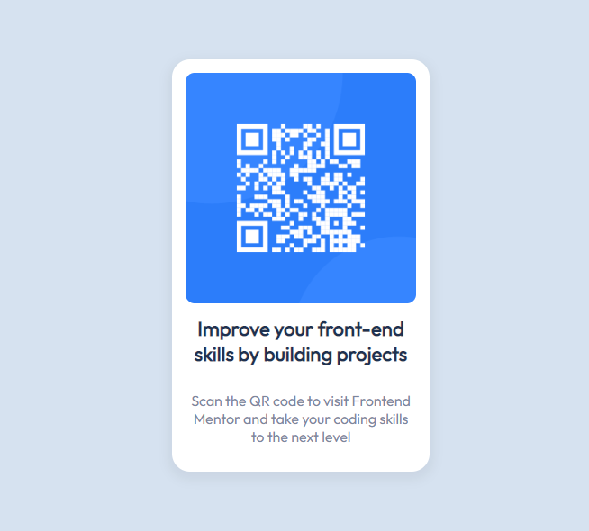

# Frontend Mentor - QR code component solution

This is a solution to the [QR code component challenge on Frontend Mentor](https://www.frontendmentor.io/challenges/qr-code-component-iux_sIO_H). Frontend Mentor challenges help you improve your coding skills by building realistic projects. 

## Table of contents

- [Overview](#overview)
  - [Screenshot](#screenshot)
  - [Links](#links)
- [My process](#my-process)
  - [Built with](#built-with)
  - [What I learned](#what-i-learned)
- [Author](#author)
- [Acknowledgments](#acknowledgments)

## Overview

### Screenshot



### Links

Solution will be provided with the help of Github Pages using the dist folder pushed in this repository.

## My process

### Built with

- Semantic HTML5 markup
- CSS custom properties
- Flexbox
- Parcel (Live Reloading)

### What I learned

Never forget about this meta tag. 
```html
    <meta name="viewport" content="width=device-width, initial-scale=1" />
```

## Author

- Frontend Mentor - [@Michael-Pasquier](https://www.frontendmentor.io/profile/Michael-Pasquier)

## Acknowledgments

Thanks to the Frontend Mentor team for the challenge.
